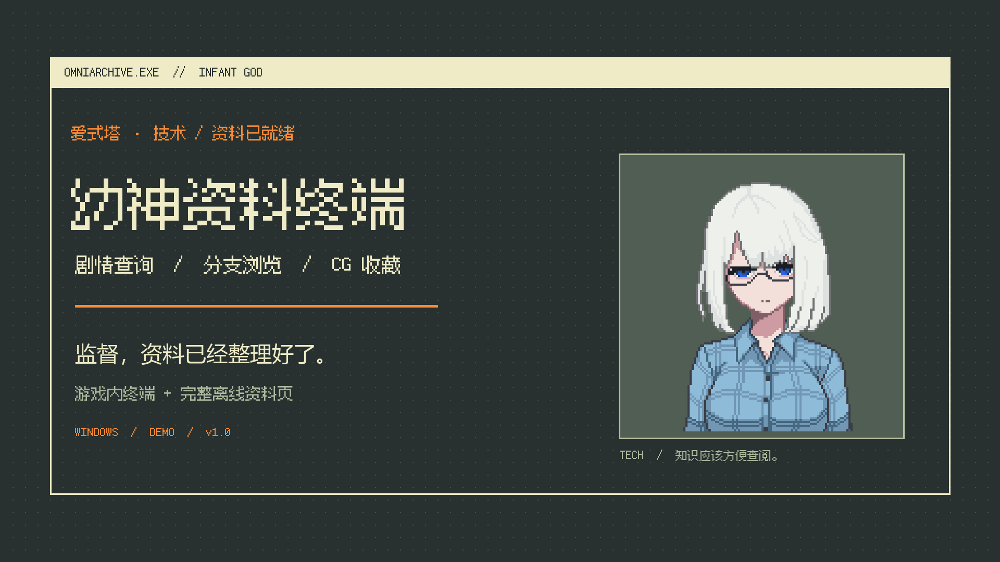

# 幼神资料终端 · OmniArchive

**监督，资料已经整理好了。**

《幼神 Demo》的剧情查询与 CG 浏览 Mod。游戏里的资料终端直接复用完整网页界面，自动读取当前存档；桌面图标、标题栏和任务栏使用游戏原生窗口。也可以单独打开离线网页查阅。

[下载发布包](https://github.com/Komeiji-Shiki/InfantGod-Archive/releases/latest) · [视频制作工具与来源](docs/VIDEO-TOOLS.md) · [构建与数据说明](docs/DATA.md)

[](https://github.com/Komeiji-Shiki/InfantGod-Archive/releases/download/v1.0.0/InfantGod-Archive-Trailer.mp4)

71 秒功能演示：真实游戏内窗口、分支图、人格发言与 CG 浏览，配有中文字幕和原创配乐。

## 可以查什么

- **剧情分支图**：把对话、选项、条件、状态变化和后续节点连起来。支持拖动、缩放、缩略图定位，点击后续节点继续阅读。
- **人物与人格发言**：人物档案与完整对话；爱式塔的共情、技术、键政、媚俗分别检索，附原作头像。
- **条件与检定**：话题等级对应的实际数值、选项前置、骰子规则与概率计算。
- **协议、记忆与收集**：协议布局、来源、成就条件和 CG 镜头。
- **两种查看范围**：完整资料，或只开放当前存档能够确认的已探索内容。

资料快照来自 2026-10-05 的游戏导出内容，包含 **211 份剧情脚本、1,221 个节点、1,445 个选项、191 项协议、188 项记忆和 14 项成就资料**。明确的未来与测试内容默认隐藏，可在网页中单独开启。

## 下载与安装

发布页提供完整 Mod 包和单文件离线网页。只想查资料，下载 `InfantGod-Archive.html` 后双击打开即可。

Mod 适用于 **Windows x64、Unity Mono 版《幼神 Demo》**，网页界面使用 **Microsoft Edge WebView2 Runtime**。解压发布包，关闭游戏，在解压目录执行：

```powershell
powershell -NoProfile -ExecutionPolicy Bypass -File .\Install-Mod.ps1 -GamePath '你的幼神 Demo\Build'
```

`GamePath` 是 `Aistalt.exe` 所在的文件夹。安装脚本会备份被覆盖的文件，并记录回退信息。已有 BepInEx 5 时复用现有加载器。

在游戏设置的 **Mod 管理器**中勾选“幼神资料终端”并应用。进入存档后，点击游戏桌面的 **资料终端** 图标，或按 **F8** 打开。窗口支持拖动、最小化、最大化和关闭，并使用游戏任务栏管理。

第一次打开时选择查看范围，当前存档会自动同步到游戏内页面。单独打开离线网页时，可以导入游戏内终端导出的 `progress.json`。

卸载时关闭游戏，在保留的安装包目录执行：

```powershell
powershell -NoProfile -ExecutionPolicy Bypass -File .\Uninstall-Mod.ps1 -GamePath '你的幼神 Demo\Build'
```

原文件按安装记录恢复；导出的进度、配置和备份保留。

## 查看范围

**全部剧透**直接开放人物后续、隐藏条件和收集资料。

**仅已探索**读取当前存档的访问记录、记忆状态和 CG 证据。一个场景包含多条分支时，只显示能够确认的共同开场。搜索也遵循当前范围。切换或重新加载存档后，终端重新读取进度。

CG 使用独立查看器，不触发主线演出。可以使用原生资源时显示原生预览；没有对应运行时引用时显示随包镜头帧。

## 源码与制作

`src/web` 是共用网页界面，`src/plugin` 是窗口与存档接入，`src/webhost` 是 WebView2 宿主，`data` 是资料快照。完整构建方法见 [DATA.md](docs/DATA.md)，窗口接入方式见 [HTML-EMBEDDING.md](docs/HTML-EMBEDDING.md)。

宣传片使用真实运行界面、中文字幕和原创配乐。镜头素材、编曲代码与剪辑脚本保留在 `media`，制作所用工具见 [VIDEO-TOOLS.md](docs/VIDEO-TOOLS.md)。

## 署名与许可

原作 **《幼神》 / Infant God**，作者 **colsalley**。[Steam 页面](https://store.steampowered.com/app/4238140/) · [官方 Mod 文档](https://wiki.infantgod.xyz/)。

原创程序代码与配乐采用 **MIT**。原作剧情、人物与场景资产，以及据其整理的资料和宣传画面，采用 **CC BY-NC-SA 4.0**：署名、非商业、相同方式共享。Fusion Pixel Font 采用 **OFL 1.1**；Dagre 与加载器组件保留各自许可。完整说明见 [LICENSE](LICENSE)。

这是玩家制作的非官方资料 Mod。
